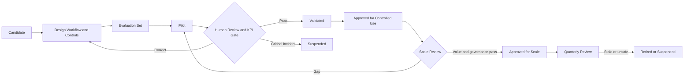

# Governance Flow

```mermaid
flowchart LR
 C[Candidate] --> D[Design Workflow and Controls]
 D --> E[Evaluation Set]
 E --> P[Pilot]
 P --> H{Human Review and KPI Gate}
 H -->|Pass| V[Validated]
 H -->|Correct| D
 H -->|Critical incident| S[Suspended]
 V --> A[Approved for Controlled Use]
 A --> G{Scale Review}
 G -->|Value and governance pass| SC[Approved for Scale]
 G -->|Gap| P
 SC --> Q[Quarterly Review]
 Q -->|Stale or unsafe| R[Retired or Suspended]
```
