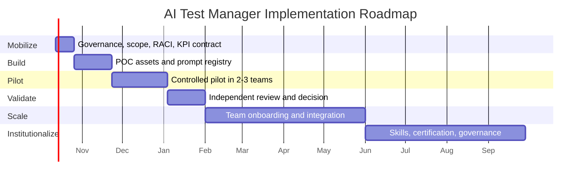

# Implementation Roadmap

```mermaid
gantt
 title AI Test Manager Implementation Roadmap
 dateFormat YYYY-MM-DD
 axisFormat %b
 section Mobilize
 Governance, scope, RACI, KPI contract :a1, 2026-10-12, 14d
 section Build
 POC assets and prompt registry :a2, after a1, 28d
 section Pilot
 Controlled pilot in 2-3 teams :a3, after a2, 42d
 section Validate
 Independent review and decision :a4, after a3, 28d
 section Scale
 Team onboarding and integration :a5, after a4, 120d
 section Institutionalize
 Skills, certification, governance :a6, after a5, 120d
```
