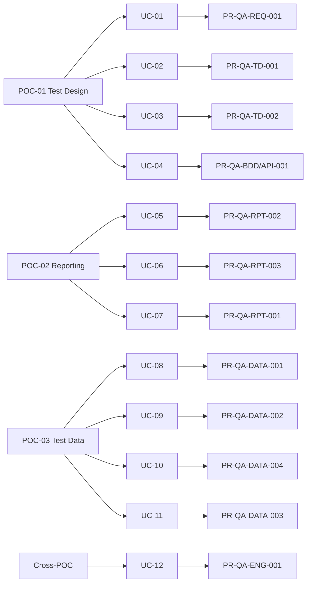

# POC - Use Case - Prompt Map

```mermaid
flowchart LR
 P1[POC-01 Test Design] --> U1[UC-01] --> R1[PR-QA-REQ-001]
 P1 --> U2[UC-02] --> R2[PR-QA-TD-001]
 P1 --> U3[UC-03] --> R3[PR-QA-TD-002]
 P1 --> U4[UC-04] --> R4[PR-QA-BDD/API-001]
 P2[POC-02 Reporting] --> U5[UC-05] --> R5[PR-QA-RPT-002]
 P2 --> U6[UC-06] --> R6[PR-QA-RPT-003]
 P2 --> U7[UC-07] --> R7[PR-QA-RPT-001]
 P3[POC-03 Test Data] --> U8[UC-08] --> R8[PR-QA-DATA-001]
 P3 --> U9[UC-09] --> R9[PR-QA-DATA-002]
 P3 --> U10[UC-10] --> R10[PR-QA-DATA-004]
 P3 --> U11[UC-11] --> R11[PR-QA-DATA-003]
 PX[Cross-POC] --> U12[UC-12] --> R12[PR-QA-ENG-001]
```
