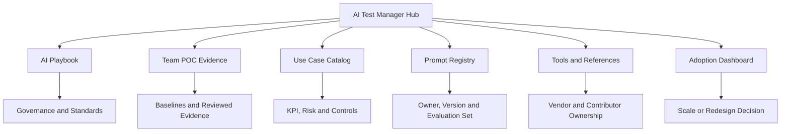

# Program Architecture

```mermaid
flowchart TD
  HUB[AI Test Manager Hub] --> PB[AI Playbook]
  HUB --> POC[Team POC Evidence]
  HUB --> UC[Use Case Catalog]
  HUB --> PR[Prompt Registry]
  HUB --> TR[Tools and References]
  HUB --> DB[Adoption Dashboard]
  PB --> GOV[Governance and Standards]
  POC --> EVD[Baselines and Reviewed Evidence]
  UC --> KPI[KPI, Risk and Controls]
  PR --> VER[Owner, Version and Evaluation Set]
  TR --> EXT[Vendor and Contributor Ownership]
  DB --> SCALE[Scale or Redesign Decision]
```
