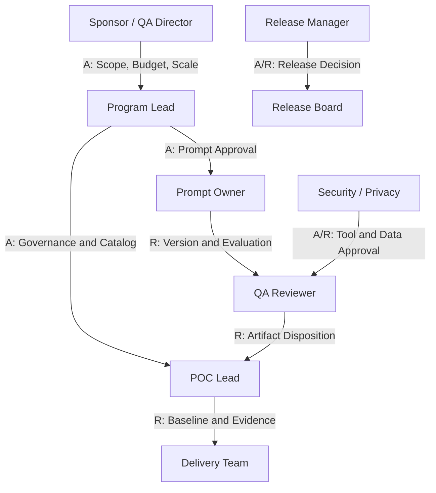

# RACI Overview

The detailed RACI table in the Combined Catalog is authoritative.

```mermaid
flowchart TD
 SP[Sponsor / QA Director] -->|A: Scope, Budget, Scale| PL[Program Lead]
 PL -->|A: Governance and Catalog| PO[POC Lead]
 PO -->|R: Baseline and Evidence| DT[Delivery Team]
 PL -->|A: Prompt Approval| PRO[Prompt Owner]
 PRO -->|R: Version and Evaluation| QR[QA Reviewer]
 SEC[Security / Privacy] -->|A/R: Tool and Data Approval| QR
 QR -->|R: Artifact Disposition| PO
 RM[Release Manager] -->|A/R: Release Decision| BOARD[Release Board]
```
