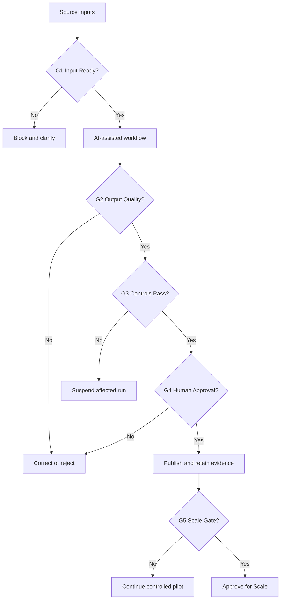

# Approval Gates Diagram

```mermaid
flowchart TD
 I[Source Inputs] --> G1{G1 Input Ready?}
 G1 -->|No| B1[Block and clarify]
 G1 -->|Yes| A[AI-assisted workflow]
 A --> G2{G2 Output Quality?}
 G2 -->|No| C[Correct or reject]
 G2 -->|Yes| G3{G3 Controls Pass?}
 G3 -->|No| X[Suspend affected run]
 G3 -->|Yes| G4{G4 Human Approval?}
 G4 -->|No| C
 G4 -->|Yes| P[Publish and retain evidence]
 P --> G5{G5 Scale Gate?}
 G5 -->|No| Q[Continue controlled pilot]
 G5 -->|Yes| S[Approve for Scale]
```
