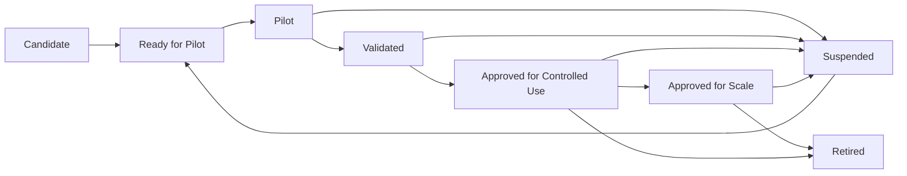

# Governance Lifecycle Diagram

```mermaid
flowchart LR
 C[Candidate] --> R[Ready for Pilot]
 R --> P[Pilot]
 P --> V[Validated]
 V --> U[Approved for Controlled Use]
 U --> S[Approved for Scale]
 P --> X[Suspended]
 V --> X
 U --> X
 S --> X
 X --> R
 S --> T[Retired]
 U --> T
```
